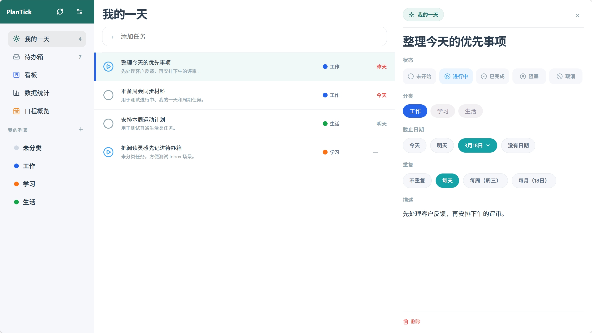
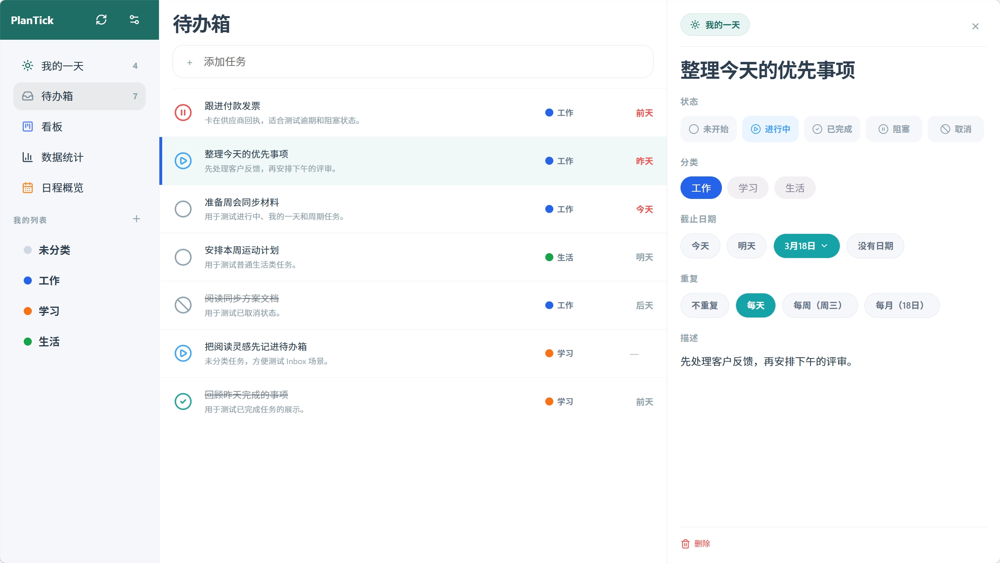
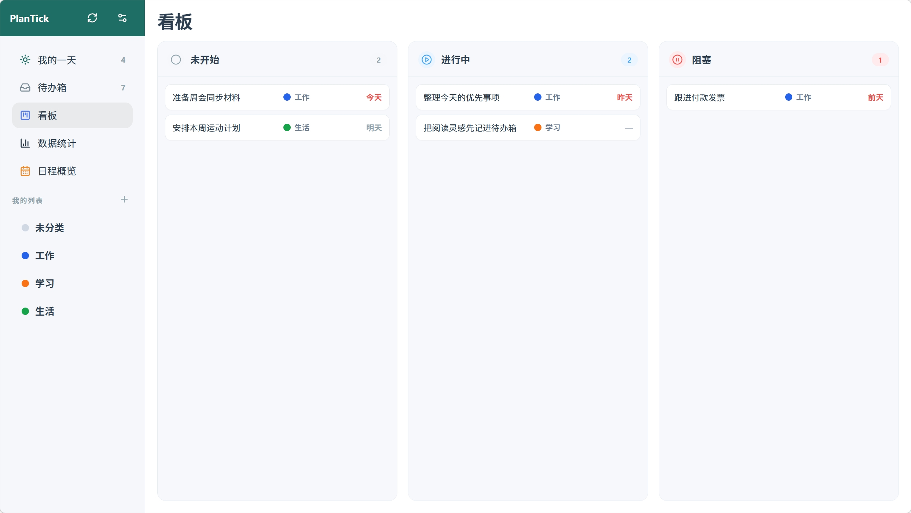
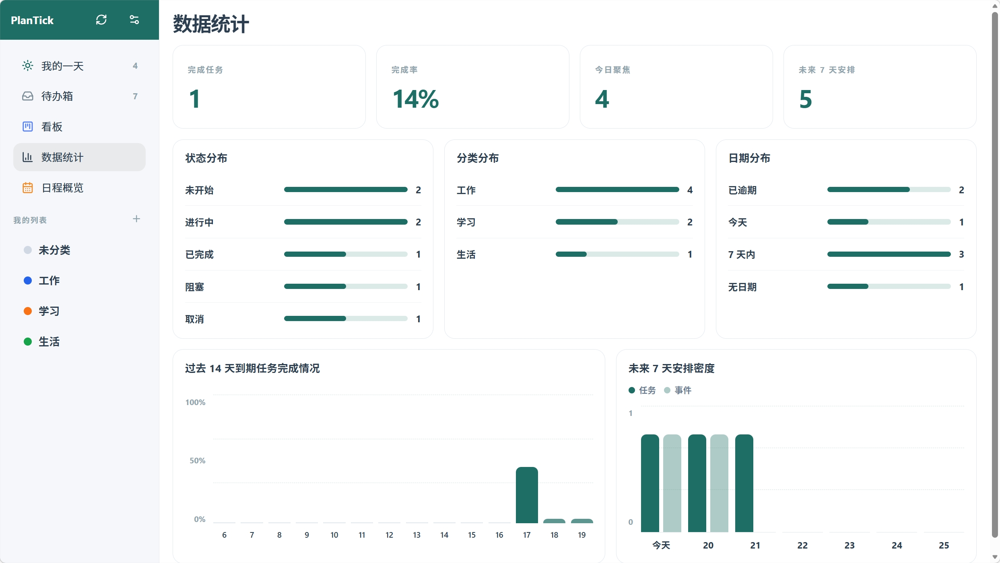
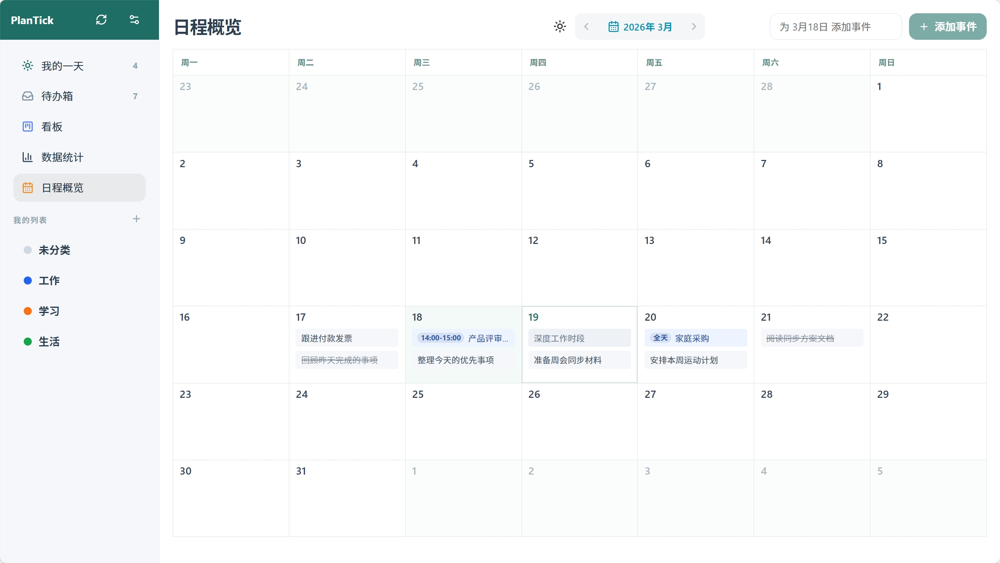

# PlanTick

<p align="center">
  
</p>

<p align="center">
  待办与日历 Web / PWA 应用，支持多状态任务管理、多端使用与自动同步。
</p>

<p align="center">
  <a href="https://github.com/Lane0218/PlanTick/stargazers">
    
  </a>
  <a href="https://github.com/Lane0218/PlanTick">
    
  </a>
  <a href="https://github.com/Lane0218/PlanTick/commits/main">
    
  </a>
</p>

PlanTick 是一个围绕“待办 + 日历 + 多端同步”构建的网页应用。它以 `Web + PWA` 形式交付，在桌面浏览器、手机浏览器和可安装的 PWA 入口上提供统一体验。

数据采用 `IndexedDB` 本地优先保存，并通过 `Supabase` 支撑工作区接入、跨设备同步与远端数据存储。

相比很多只提供“未完成 / 已完成”二元切换的待办工具，PlanTick 更强调任务过程管理。每个任务都可以在 **未开始**、**进行中**、**已完成**、**阻塞** 之间流转，适合更真实地反映执行状态、识别卡点并管理推进节奏。

## 快速入口

- 产品规格：[doc/SPEC.md](./doc/SPEC.md)
- 实施计划：[doc/PLAN.md](./doc/PLAN.md)
- 本地开发：`npm install` / `npm run dev`
- 构建检查：`npm run build`
- 端到端测试：`npm run test:e2e`

## 产品截图

### 我的一天

聚合当天优先事项，支持快速录入、状态切换和右侧详情编辑，适合作为默认进入应用后的主工作区。



### 待办箱

按清单方式统一管理全部待办，结合分类、截止日期和四种任务状态，适合集中整理尚未完成的事项。



### 看板

将任务按状态映射到看板列中，便于围绕 **未开始**、**进行中** 和 **阻塞** 三种状态观察整体推进情况。



### 数据统计

通过任务完成率、状态分布、分类分布和近期安排密度，帮助快速回看当前执行节奏。



### 日程概览

在月历中统一查看待办与事件的日期分布，适合从时间维度安排接下来几天或几周的计划。



## 核心功能

- 多状态任务管理：支持 **未开始**、**进行中**、**已完成**、**阻塞** 四种状态，不把任务粗暴压缩成“做完 / 没做完”两类，更适合真实跟踪执行过程。
- 待办管理：支持创建、编辑、删除待办，并维护标题、备注、截止日期、重复规则与状态流转。
- 分类体系：支持为待办分配分类和颜色，并按分类维度进行筛选与组织。
- 日程记录：支持手动创建、编辑、删除日程，在时间维度上补充待办之外的安排。
- 多视图查看：除了列表视图，还提供看板、统计、月历等视图，便于从不同角度管理计划。
- PWA 安装：支持安装到桌面和移动端主屏，保留更接近原生应用的入口体验。

## 使用体验

### 本地优先

PlanTick 优先将数据写入本地 `IndexedDB`，保证页面刷新、离线访问和弱网环境下的基本可用性。应用内部维护本地数据、副本状态与同步队列，界面读取以本地结果为主，不依赖每次操作都等待网络往返。

### 工作区接入

应用通过“工作区口令”接入同一份数据，不额外暴露注册/登录式账号流程。用户可以在新设备上创建工作区或输入已有口令加入工作区，在不同设备之间访问同一套待办、分类与日程数据。

### 多端同步

同步链路基于 `Supabase` 构建，采用本地优先 + outbox 推送 + 远端补拉的方式同步数据。对于分类、待办、日程这些核心实体，冲突处理遵循最后更新时间覆盖，目标是在低复杂度前提下保持跨设备数据一致。

## 技术实现

- 前端：`React 19`、`TypeScript`、`Vite`
- 界面能力：`react-router-dom`、`react-day-picker`、`lucide-react`
- 本地存储：`IndexedDB`（通过 `idb` 访问）
- 云端与同步：`Supabase`
- 安装能力：`vite-plugin-pwa`
- 测试：`Playwright`

当前仓库已包含待办、分类、日程、工作区接入、同步状态与多视图基础能力，并提供对应的本地存储层、同步层和前端页面实现。

## 本地开发

### 环境要求

- Node.js 20+
- npm 10+
- 可选：本地或远端 Supabase 环境

### 前端环境变量

复制 `.env.example` 为 `.env.local`：

```bash
cp .env.example .env.local
```

填写以下变量：

- `VITE_SUPABASE_URL`
- `VITE_SUPABASE_ANON_KEY`

如果未配置 Supabase，应用仍可用于部分本地体验，但工作区接入和云端同步能力无法完整验证。

### 常用命令

```bash
npm install
npm run dev
```

默认开发地址：`http://localhost:5173`

构建、检查与测试：

```bash
npm run build
npm run lint
npm run preview
npm run test:e2e
```

## Supabase 本地联调

如果需要验证工作区创建、加入与同步链路，可使用仓库内的 Supabase 配置。

前置准备：

```bash
cp supabase/.env.example supabase/.env.local
```

填写以下变量：

- `SUPABASE_URL`
- `SUPABASE_ANON_KEY`

推荐本地流程：

```bash
supabase start
supabase db reset
supabase functions serve --env-file supabase/.env.local
```

仓库内已包含 Supabase 相关目录与函数入口：

- `supabase/migrations/`
- `supabase/functions/workspace-create`
- `supabase/functions/workspace-join`

## 部署

预览部署：

```bash
npm run deploy:preview
```

生产部署：

```bash
npm run deploy:prod
```

首次在本地手动部署前，建议先确认当前目录已关联正确的 Vercel 项目：

```bash
npx vercel whoami
npx vercel link
```
